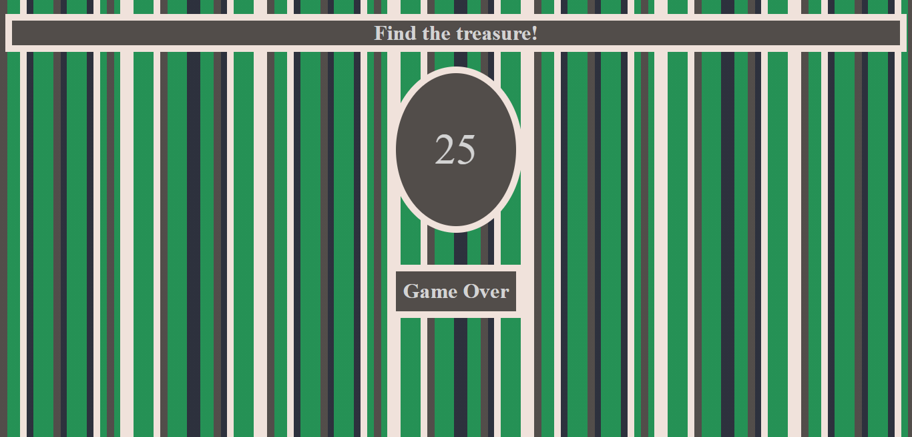

# Treasure

## General Info

The Treasure is a simple project developed using JavaScript, CSS, HTML canvas. This is an interesting game.
The player has to find treasure in less than 25 clicks on the map. If the player find the treasure he will win and receive the confetti! What a surprise...

## To play the game:
https://anadoh.github.io/treasure/

## Technologies
* HTML 
* CSS 
* JavaScript

## Screenshots

## Setup
How to run this project.
1. Clone this repo
2. Just open index.html

## Status
Project is finished.

## License
MIT

